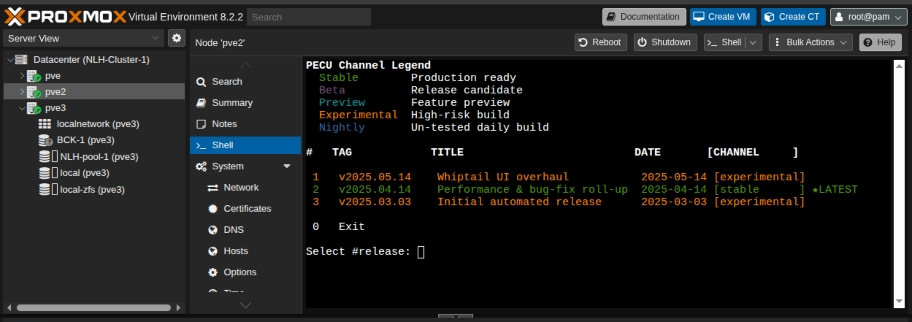
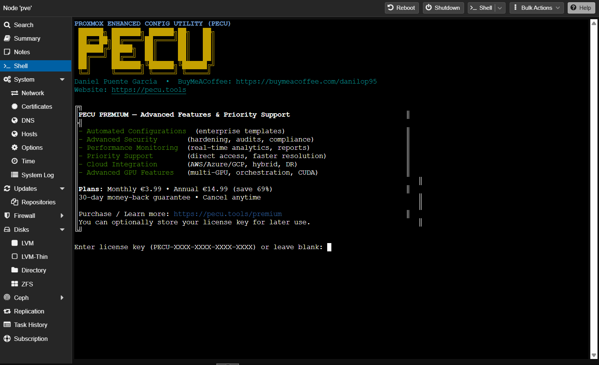

<h1 align="center">
  <br>
  <strong>Proxmox Enhanced Configuration Utility</strong><br>
  <sub>( PECU )</sub>
</h1>

<p align="center">
  <a href="https://github.com/Danilop95/Proxmox-Enhanced-Configuration-Utility/actions">
    
  </a>
  <a href="https://github.com/Danilop95/Proxmox-Enhanced-Configuration-Utility/wiki">
    
  </a>
  <a href="https://github.com/Danilop95/Proxmox-Enhanced-Configuration-Utility/releases">
    
  </a>
  <a href="LICENSE">
    
  </a>
</p>

<hr style="border: 1px solid #444; margin: 20px 0;">

<p align="center">
  <a href="https://buymeacoffee.com/danilop95ps" target="_blank" rel="noopener noreferrer" style="margin-right:8px;">
    
  </a>
  <a href="https://ko-fi.com/G2G2E2W8B" target="_blank" rel="noopener noreferrer">
    
  </a>
</p>

## Table of Contents

* [Overview](#overview)
* [Requirements & Compatibility](#requirements--compatibility)
* [Quick Start](#quick-start)
  * [Direct execution (recommended)](#direct-execution-recommended)
  * [Run a specific release tag](#run-a-specific-release-tag)
  * [Offline / local install](#offline--local-install)
* [Release Selector](#release-selector)
* [VM Templates System](#vm-templates-system)
* [Known limitations](#known-limitations)
* [Features](#features)
* [Community & Contribution](#community--contribution)
* [Support the Project](#support-the-project)
* [License](#license)

---

## Overview

PECU is a Bash-based utility for Proxmox VE focused on repeatable host configuration and GPU passthrough workflows. It provides an interactive menu-driven interface for common operations (repositories, kernel parameters, VFIO, rollback), with an emphasis on safe reruns (idempotency), backups, and clear logging.

Primary use cases:
- GPU passthrough setup and verification (NVIDIA / AMD / Intel)
- Bootloader-aware kernel parameter management (systemd-boot / GRUB)
- VFIO configuration with validation and rollback support
- VM template creation (and a declarative template system)

---

## Requirements & Compatibility

|                |                                                                                                                                                                                                                                    |
| -------------- | ---------------------------------------------------------------------------------------------------------------------------------------------------------------------------------------------------------------------------------- |
| **Platform**   |                                                         |
| **CPU arch**   |                                                                                                                         |
| **Privileges** |                                                                                                         |
| **Boot**       |                                                                                               |


Notes:
- ARM / Raspberry Pi builds of Proxmox are not supported at this time.
- This project modifies system configuration (boot params, initramfs, modprobe). Review changes and ensure you have console access before applying.

---

## Quick Start

### Direct execution (recommended)

The release selector fetches available tagged releases and lets you launch a chosen version/channel.

```bash
bash <(curl -fsSL https://raw.githubusercontent.com/Danilop95/Proxmox-Enhanced-Configuration-Utility/main/scripts/pecu_release_selector.sh)
````

#### Release Selector

<p align="center">
  
</p>

#### Premium Interface (optional)

<p align="center">
  
</p>

#### PECU UI

<p align="center">
  
</p>

---

### Run a specific release tag

To run a specific release directly (recommended for reproducibility in documentation and automation):

```bash
TAG="v2026.01.05"
bash <(curl -fsSL "https://raw.githubusercontent.com/Danilop95/Proxmox-Enhanced-Configuration-Utility/${TAG}/src/proxmox-configurator.sh")
```

---

### Offline / local install

All releases ship a `.tar.gz` bundle.

```bash
VERSION="v2026.01.05"  # choose a tag from the Releases page
wget "https://github.com/Danilop95/Proxmox-Enhanced-Configuration-Utility/releases/download/${VERSION}/PECU-${VERSION#v}.tar.gz"
tar -xzf "PECU-${VERSION#v}.tar.gz"
cd "PECU-${VERSION#v}"

# Robust entrypoint detection (bundle layouts may differ between releases)
if [ -x "src/proxmox-configurator.sh" ]; then
  chmod +x src/proxmox-configurator.sh
  sudo ./src/proxmox-configurator.sh
elif [ -x "proxmox-configurator.sh" ]; then
  chmod +x proxmox-configurator.sh
  sudo ./proxmox-configurator.sh
else
  echo "Could not find proxmox-configurator.sh in the extracted bundle."
  echo "Expected: ./src/proxmox-configurator.sh or ./proxmox-configurator.sh"
  exit 1
fi
```

---

## Release Selector

`pecu_release_selector.sh` is an interactive menu that queries GitHub releases/tags and groups them by `PECU-Channel` metadata (Stable, Beta, Preview, Experimental, Nightly). This is intended to keep the list readable and to reduce accidental use of non-stable builds.

The legacy selector script (if present) is kept only for compatibility and may be removed in a future release.

---

## VM Templates System

PECU includes a declarative VM template system with CLI tools.

Highlights:

* Declarative YAML templates for common configurations
* JSON Schema validation
* CLI management (`templatectl.sh`) with `--dry-run` rendering
* Storage pool flexibility (`local-lvm`, `local`, auto-detection)

Quick usage:

```bash
# List available templates
src/tools/templatectl.sh list --channel Stable

# Validate all templates
src/tools/templatectl.sh validate templates/

# Preview commands (safe, no execution)
src/tools/templatectl.sh render templates/windows/windows-gaming.yaml \
  --vmid 200 --storage-pool local-lvm --dry-run

# Apply template (creates VM)
sudo src/tools/templatectl.sh apply templates/windows/windows-gaming.yaml \
  --vmid 200 --storage-pool local-lvm
```

See [templates/README.md](templates/README.md) for details.

---

## Known limitations

Before reporting a new issue, review the following known topics:

* SR-IOV environments and GPU selection: virtual functions can affect discovery and device selection. See #32.
* APU/iGPU platforms (e.g., AMD Ryzen Phoenix): VFIO binding must be surgical; incorrect binding can include unintended PCI IDs. See #33.
* Offline/local install path differences: bundle layout can vary between releases; follow the robust offline steps above. See #31.
* AMD 5700 XT vendor reset: vendor-reset effectiveness depends on model/kernel; tracked as FYI. See #29.
* Template behavior reports: tracked in #25.

Issue tracker: [https://github.com/Danilop95/Proxmox-Enhanced-Configuration-Utility/issues](https://github.com/Danilop95/Proxmox-Enhanced-Configuration-Utility/issues)

---

## Features

| Category              | Highlights                                                                 |
| --------------------- | -------------------------------------------------------------------------- |
| Repositories          | Backup/restore sources, optional no-subscription repo, safe idempotent ops |
| GPU passthrough       | Guided setup for NVIDIA/AMD/Intel; rollback; verification helpers          |
| Kernel parameters     | Add/validate common flags with risk prompts                                |
| Multi-GPU & discovery | Detects multiple GPUs; improved discovery in complex PCI topologies        |
| VM templates          | Declarative templates + CLI management                                     |
| Logging               | `/var/log/pecu.log` with timestamps and rotation                           |

---

## Community & Contribution

Bug reports and feature requests:

* Use the GitHub Issue tracker.
* Include the release tag you ran, host details (PVE version, CPU, GPU), and relevant logs/output.

Code contributions:

* Keep commits focused, run `shellcheck`, and open a Pull Request against `main`.

Discord: [https://discord.gg/euQTVNc2xg](https://discord.gg/euQTVNc2xg)
Patreon: [https://www.patreon.com/c/DVNILXP95](https://www.patreon.com/c/DVNILXP95)

---

## Star History

[](https://www.star-history.com/#Danilop95/Proxmox-Enhanced-Configuration-Utility&Date)

---

## Support the Project

If PECU is useful in your workflows and you want to support continued development:

<p align="center">
  <a href="https://buymeacoffee.com/danilop95ps" target="_blank" rel="noopener noreferrer" style="margin-right:8px;">
    
  </a>
  <a href="https://ko-fi.com/G2G2E2W8B" target="_blank" rel="noopener noreferrer" style="margin-left:8px;">
    
  </a>
</p>

---

## License

See [LICENSE](LICENSE).

Important: ensure the README license statement matches the repository `LICENSE` file to avoid confusion (e.g., MIT vs GPL-3.0).

```
