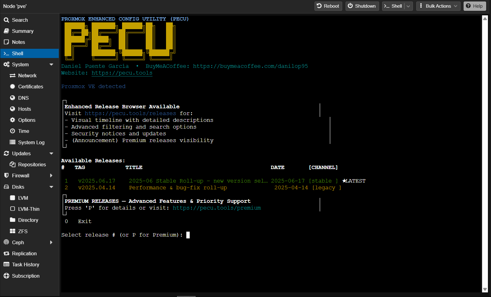

<h1 align="center">
  
  <br>
  Proxmox-Enhanced-Configuration-Utility<br><sub>( PECU )</sub>
</h1>


<p align="center">
  <a href="https://github.com/Danilop95/Proxmox-Enhanced-Configuration-Utility/actions">
    </a>
  <a href="https://github.com/Danilop95/Proxmox-Enhanced-Configuration-Utility/wiki">
    </a>
  <a href="https://github.com/Danilop95/Proxmox-Enhanced-Configuration-Utility/releases">
    </a>
  <a href="LICENSE">
    </a>
</p>

---

## Table of Contents
- [Overview](#overview)
- [Requirements & Compatibility](#requirements--compatibility)
- [Quick Start](#quick-start)
  - [Direct execution (recommended)](#direct-execution-recommended)
  - [Offline / local install](#offline--local-install)
- [What Is the Release Selector?](#what-is-the-release-selector)
- [Features](#features)
- [Community & Contribution](#community--contribution)
- [Support the Project](#support-the-project)
- [License](#license)

---

## Overview
**PECU** is a single-shell utility that makes day-to-day Proxmox VE management
as painless as possible:

* one-line installer  
* interactive menus for repositories, kernel flags, GPU passthrough, etc.  
* reversible operations (backup / rollback built-in)  
* auto-detects NVIDIA, AMD **and** Intel iGPUs out of the box  

---

### Requirements & Compatibility

> The selector and the underlying scripts are designed for a **typical, up-to-date Proxmox host**.
> If your stack falls outside the matrix below, use at your own risk.

|                              |                                                                                                                                                                                                                                           |
| ---------------------------- | ----------------------------------------------------------------------------------------------------------------------------------------------------------------------------------------------------------------------------------------- |
| **Platform**                 |  *(tested weekly on the latest ISO)*                                                     |
| **CPU arch**                 |                                                                                                                                                       |
| **Privileges**               |                                                                                                                                

> **Heads-up** PECU does **not** support ARM / Raspberry Pi builds of Proxmox at this time.
> Community ports are welcome, but official testing is x86-64 only.

---


## Quick Start

### Direct execution (recommended)

> **New in 2025-05** – a tiny selector script fetches **all** tagged releases and  
> lets you launch whichever version (Stable, Beta, Experimental…) you want.

```bash
bash <(curl -sL \https://raw.githubusercontent.com/Danilop95/Proxmox-Enhanced-Configuration-Utility/refs/heads/main/scripts/pecu_release_selector.sh)
```


#### Release Selector

<p align="center">
  
</p>

#### PECU-Script
<p align="center">
  
</p>

---


### Offline / local install

All releases ship a `.tar.gz` bundle:

```bash
VERSION="v2025.04.14"                     # pick any tag
wget https://github.com/Danilop95/Proxmox-Enhanced-Configuration-Utility/releases/download/$VERSION/PECU-${VERSION#v}.tar.gz
tar -xzf PECU-${VERSION#v}.tar.gz
cd PECU-${VERSION#v}/src
chmod +x proxmox-configurator.sh
sudo ./proxmox-configurator.sh
```

---

## What Is the Release Selector?

* `pecu_release_selector.sh` is a **new ASCII-driven menu** I built over the last few months.
  It talks directly to the GitHub API, parses every tag, and sorts them by the
  custom **`PECU-Channel`** labels I introduced (Stable, Beta, Preview, Experimental, Nightly).
  The channels keep the list tidy and make it obvious which way the project is heading.
* Marking a build as **Experimental** instantly flags it orange in the menu,
  so I can ship rough prototypes or quick-fix versions without confusing people who only want Stable releases.
lector.
* `pecu_release_selector_old.sh` still exists **only as a shim** that `exec`s the new script — **it will be removed on _05 July 2025_**.

---

## Features

| Category              | Highlights                                                                               |
| --------------------- | ---------------------------------------------------------------------------------------- |
| **Repositories**      | Backup / restore `sources.list`, add “non-subscription” repo, edit with Nano.            |
| **GPU Passthrough**   | Wizard-style setup for NVIDIA, AMD, Intel; supports driverctl override; rollback option. |
| **Kernel Tweaks**     | Add `pcie_acs_override`, `video=efifb:off`, or custom flags with risk prompts.           |
| **Multi-GPU**         | Detects multiple GPUs and lets you choose the one to passthrough.                        |
| **Intel iGPU (test)** | Experimental automatic isolation of iGPU functions.                                      |
| **Logging**           | Detailed `/var/log/pecu.log` with timestamps.                                            |

---

## Community & Contribution

PECU grows through clear bug reports, well-scoped ideas, and peer-reviewed code.  
If you would like to get involved, choose the channel that best suits your needs:

| Purpose | Channel |
|---------|---------|
| **Bug reports / feature requests** | Use the GitHub [Issue tracker](../../issues). Please include the tag you were running, a concise description, and any relevant console output. |
| **Code contributions** | Fork the repository, branch from `main`, run `shellcheck`, keep commits focused, then open a Pull Request. |
| **Technical discussion and quick feedback** | Join the PECU Discord server: <https://discord.gg/euQTVNc2xg>. The server is used for informal Q&A, brainstorming future features, and sharing configuration tips. |
| **Sustained support and early-access builds** | Patreon memberships are available at <https://www.patreon.com/c/DVNILXP95>. Patrons receive preview builds, detailed implementation notes, and can vote on the development roadmap. |

---

### Support the Project

If PECU saves you time in daily operations and you wish to accelerate its development, consider a one-off donation:

<p align="center">
  <a href="https://buymeacoffee.com/danilop95ps" target="_blank">
    
  </a>
</p>

Your support funds additional test hardware.


## License

**GPL-3.0** – see [LICENSE](LICENSE).
Feel free to fork, adapt, and share under the same terms.
